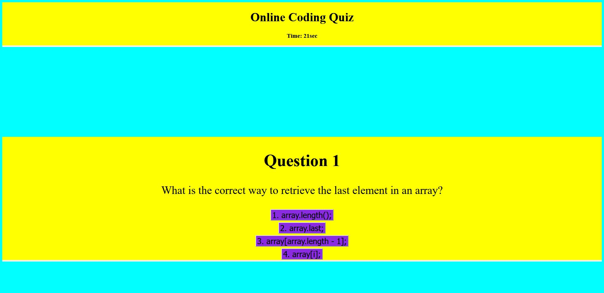

# Online Code Quiz

## Description

This is an online javascript coding quiz. The user is given 5 different question with 60sec to complete and when a question is answered wrong 4 seconds is taken off the clock.
The user is able to save their highscore and check the heigh score list.

## Link to webpage: https://josephteklu.github.io/Code-Quiz

## Created by Joseph Teklu

## MIT License (check directory)
